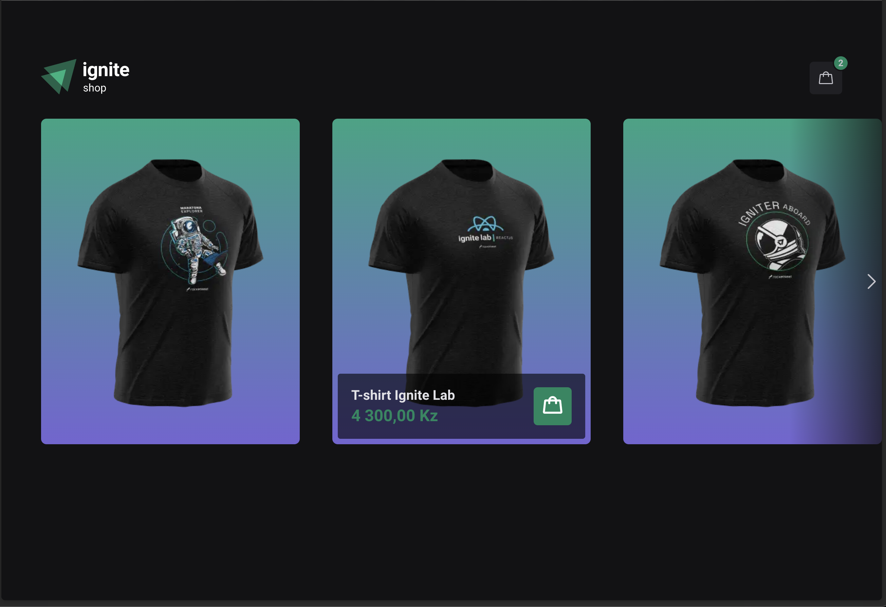
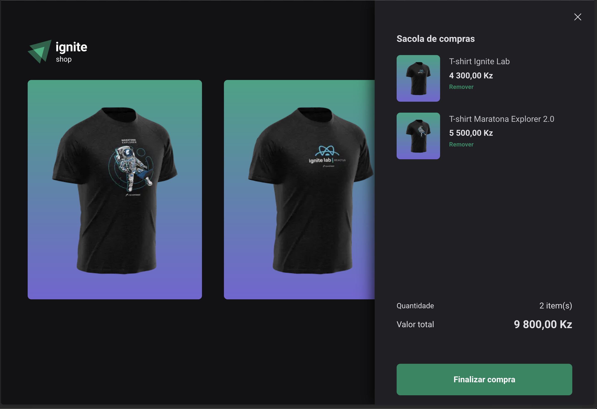

# Ignite Shop 2.0!

Chapter 4 of Ignite | I created a virtual store for sweater sales, using Nextjs

<h1 align="center">
  
  
</h1>

# Features
- Add products to cart
- View product details
- Checkout page using the stripe api ✨

## Installation

**You need to install  [Node.js](https://nodejs.org/en/download/)  or  [Yarn](https://yarnpkg.com/)  first, then in order to clone the project via HTTPS, run this command:**

    https://github.com/daniel-koti/ignite-shop.git
    
You need to create an account on stripe, and use it as your content    manager. Register your products, and use the public and secret keys    to connect to the stripe api.

**Install dependencies**

    npm install
or

    yarn

